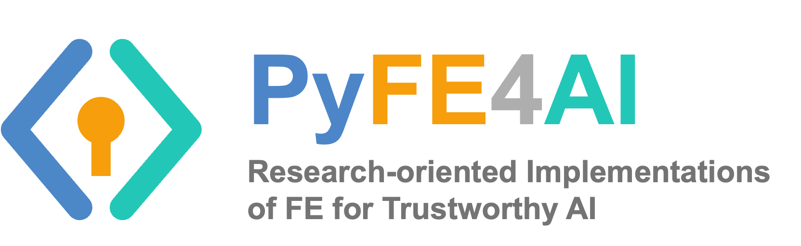

<p align="center">
  
</p>

<p align="center">
  
  
  
  
  
  
</p>

<p align="center">
  🌐 <a href="https://spire-studio.github.io/pyfe4ai/"><strong>Project Page</strong></a> ·
  📖 <a href="https://spire-studio.github.io/pyfe4ai/docs/"><strong>Documentation</strong></a> ·
  🐛 <a href="https://github.com/spire-studio/pyfe4ai/issues"><strong>Issues</strong></a>
</p>

# PyFE4AI

PyFE4AI is a research-oriented Python library for functional encryption in
trustworthy AI systems.
It currently focuses on inner-product and quadratic
functional encryption, with implementations spanning single-input, multi-input,
multi-client, threshold, decentralized, and function-hiding settings.

## Quick Start

```bash
conda env create -f environment.yml
conda activate pyfe4ai
pip install -e ".[test]"        # editable with test extras
python -m pytest -m core -q     # run the core test suite
```

For pairing-based FE families (and the full test suite, `python -m pytest -q`),
additionally install:

```bash
pip install -e ".[test,pairing]"
```

## Usage

```python
from pyfe4ai import SIFE, SIFEKeyGenerator

x = [2, 1, 3]
y = [4, 5, 6]

# Key generation. sec_param is the bit length of the DDH modulus, not a
# security level: 128 keeps the demo fast but is NOT secure (use >= 2048).
kg = SIFEKeyGenerator({"sec_param": 128, "eta": len(x)})
kg.setup()
pp = kg.get_public_parameters()
sk = kg.get_private_keys()
dk = kg.get_decryption_keys("sid_0", credentials={"fusion_weight": y})

# Encrypt (needs pp + sk)
encryptor = SIFE({"precision": 3, "keys": {"pp": pp, "sk": sk}})
ct = encryptor.encrypt(x)

# Decrypt (needs pp + dk)
decryptor = SIFE({"precision": 3, "keys": {"pp": pp}})
result = decryptor.decrypt(ct, dk, y)
print("<x, y> =", result)   # → 31
```

See `examples/sife_minimal.py` for the full runnable version.

## Key Features

- **Multiple FE families** — DDH, LWE, Ring-LWE, FullySec-LWE, Paillier, and Damgård instantiations across SIFE, MIFE, and MCFE
- **Threshold & decentralized** — `tMIFE`, `tMCFE`, `dMCFE` for distributed trust settings
- **Function-hiding** — pairing-based FH-IPE and FH-Multi-IPE with full inner-product privacy
- **Quadratic FE** — SGP (secret-key) and Quad (public-key) quadratic functional encryption
- **ML adapter** — `utils/ml_adapter.py` for encrypted linear inference and federated gradient aggregation
- **Precision toolkit** — `utils/quantization.py` for float ↔ integer quantization with configurable bit-width
- **Discrete-log solvers** — in-memory dlog table (default) with on-the-fly BSGS as optional backup in `utils/dlog_solver.py`
- **NTT acceleration** — number-theoretic transform for Ring-LWE polynomial multiplication in `utils/ring_lwe_utils.py`
- **Structured exceptions** — `FEError` hierarchy in `utils/exceptions.py`

## Implemented Schemes

| Family | Instantiations | Paper(s) |
|--------|---------------|----------|
| **SIFE** (single-input) | DDH, DDH-Dynamic, LWE | [ABDP15](https://eprint.iacr.org/2015/017.pdf) (PKC '15) |
| | Damgård-DDH, FullySec-LWE, Paillier | [ALS16](https://eprint.iacr.org/2016/011.pdf) (CRYPTO '16) |
| | Ring-LWE | [BMMS21](https://eprint.iacr.org/2021/046.pdf) (PKC '22) |
| | FH-IPE *(pairing)* | [KLMMRW](https://eprint.iacr.org/2016/440.pdf) (SCN '18) |
| | Partial-FH-IPE *(pairing)* | [Gay20](https://eprint.iacr.org/2020/093.pdf) (PKC '20) |
| **MIFE** (multi-input) | DDH, DDH-Hybrid-α, Damgård-DDH, LWE, FullySec-LWE, Ring-LWE, Paillier, FH-IPE | [ACFGU18](https://eprint.iacr.org/2017/972.pdf) (CRYPTO '18) ¹ |
| | FH-Multi-IPE *(pairing)* | [DOT18](https://eprint.iacr.org/2018/061.pdf) (PKC '18) |
| **MCFE** (multi-client) | DDH, Damgård-DDH, LWE, FullySec-LWE, Ring-LWE, Paillier | [CDGPP18](https://eprint.iacr.org/2017/989.pdf) (ASIACRYPT '18) ¹ |
| | FH-Multi-IPE *(pairing)* | CDGPP18 + [DOT18](https://eprint.iacr.org/2018/061.pdf) |
| **Decentralized** | dMCFE-DDH | [ABKW19](https://eprint.iacr.org/2019/020.pdf) (PKC '19) |
| | dMCFE-LWE, dMCFE-Ring-LWE, dMCFE-Paillier, dMCFE-FH-Multi-IPE | ABKW19 ¹ |
| **Threshold** | tMIFE (DDH, LWE), tMCFE (DDH, LWE, Ring-LWE, FH-Multi-IPE) | [Xu+24](https://doi.org/10.1109/TDSC.2024.3350206) (IEEE TDSC '24) ² |
| **Quadratic** | SGP (secret-key), Multi-Input SGP | [DSGPP18](https://eprint.iacr.org/2018/206.pdf) (ePrint) |
| | Quad (public-key) | [Gay20](https://eprint.iacr.org/2020/093.pdf) (PKC '20) |

> ¹ Multi-input, multi-client, and decentralized schemes compose a
> *framework paper* (ACFGU18 / CDGPP18 / ABKW19) with a per-slot
> *single-input primitive* — the concrete SIFE instantiation (ABDP15, ALS16,
> BMMS21, etc.) varies by row. See each module's docstring for the exact
> combination.
>
> ² Threshold variants add a Shamir secret-sharing layer on top of the
> corresponding MIFE or MCFE scheme; there is no separate standalone paper
> for each combination.

> **⚠️ Several of these schemes have known security issues.** Read
> [Known Issues / Security Notice](#known-issues--security-notice) before
> relying on any privacy property.

## Repository Layout

- `pyfe4ai/`: installable Python package
  - `schemes/`: core cryptographic scheme implementations
    - `sife/`: single-input families
    - `mife/`: multi-input families
    - `mcfe/`: multi-client families
    - `quadratic/`: quadratic functional encryption families
  - `utils/`: utility modules
    - `crypto_constants.py`, `crypto_utils.py`: group generation and constants
    - `lwe_utils.py`, `ring_lwe_utils.py`: LWE / Ring-LWE helpers with NTT
    - `dlog_solver.py`: in-memory dlog table + BSGS discrete-log recovery
    - `ml_adapter.py`: ML integration (encrypted inference, FL aggregation)
    - `quantization.py`: float ↔ integer quantization toolkit
    - `exceptions.py`: `FEError` exception hierarchy
    - `sampling_utils.py`, `matrix_utils.py`, `modular_utils.py`: math helpers
    - `pairing_backend.py`, `pairing_utils.py`: charm-crypto pairing layer
  - `logger.py`, `config.yaml`: logging configuration
- `docs/`: Sphinx API documentation (see [API Documentation](#api-documentation))
- `tests/`: end-to-end and regression tests (`sife/`, `mife/`, `mcfe/`, `quadratic/`)
- `examples/`: minimal runnable usage examples
- `benchmarks/`: lightweight benchmark scripts
- `environment.yml`: reproducible Conda environment
- `Dockerfile.pairing`: Docker-based pairing-enabled test environment

## Naming Convention

Scheme modules are organized by family and then named by instantiation:

- `<family>/<instantiation>.py`
- `<family>/<instantiation>_<variant>.py`

Examples:

- `pyfe4ai/schemes/sife/ddh.py`
- `pyfe4ai/schemes/sife/damgard_ddh.py`
- `pyfe4ai/schemes/mife/ddh_threshold.py`
- `pyfe4ai/schemes/mcfe/ring_lwe_threshold.py`

The `instantiation` segment may describe a security assumption, a concrete
cryptosystem, or a named construction lineage, depending on what is most
accurate for the scheme:

- `ddh`: DDH-based discrete-log style construction
- `lwe`: LWE-based instantiation
- `paillier`: Paillier-based instantiation
- `damgard_ddh`: Damgard-style DDH instantiation

## Running Tests

```bash
python -m pytest -q                # all tests
python -m pytest -m core -q        # core FE/IPFE smoke lane only
python -m pytest -m extended -q    # pairing-heavy & quadratic families only
```

The `core` lane is the main public release lane. The `extended` lane covers
pairing-heavy and quadratic families that remain publicly available but are kept
outside the minimal smoke path.

## Examples

Minimal runnable examples are grouped as follows:

- Core FE/IPFE
  - `examples/sife_minimal.py`
  - `examples/mife_minimal.py`
  - `examples/mcfe_threshold_demo.py`
- LWE and threshold/decentralized variants
  - `examples/lwe_minimal.py`
  - `examples/mife_lwe_minimal.py`
  - `examples/mcfe_lwe_minimal.py`
  - `examples/mcfe_lwe_decentralized_demo.py`
  - `examples/mcfe_lwe_threshold_demo.py`
  - `examples/mife_lwe_threshold_demo.py`
- ML / privacy-preserving AI
  - `examples/ml_encrypted_inference.py`
  - `examples/ml_fl_aggregation.py`
- Pairing-based extended families
  - `examples/mife_fh_multi_ipe_minimal.py`
  - `examples/mcfe_fh_multi_ipe_minimal.py`
  - `examples/mcfe_fh_multi_ipe_decentralized_demo.py`
  - `examples/mcfe_fh_multi_ipe_threshold_demo.py`
- Quadratic FE
  - `examples/quadratic_sgp_minimal.py`
  - `examples/quadratic_quad_minimal.py`

For a short walkthrough of the example set, see `examples/README.md`.

Lightweight benchmark scripts are available under `benchmarks/`.
For benchmark entry points, see `benchmarks/README.md`.

## API Documentation

Browse the full API reference online at
**<https://spire-studio.github.io/pyfe4ai/docs/>** (rebuilt automatically on
every merge to `main`).

To build the docs locally instead:

```bash
pip install -e ".[doc]"          # install Sphinx + theme
cd docs && make html             # build HTML docs
open _build/html/index.html      # view locally
```

## Pairing-Based Schemes

The schemes in the following files depend on
`charm-crypto-framework`:

- `pyfe4ai/schemes/sife/fh_ipe_pairing.py`
- `pyfe4ai/schemes/sife/part_fh_ipe_pairing.py`
- `pyfe4ai/schemes/mife/fh_ipe_pairing.py`
- `pyfe4ai/schemes/mife/fh_multi_ipe_pairing.py`
- `pyfe4ai/schemes/mcfe/fh_multi_ipe_pairing.py`
- `pyfe4ai/schemes/mcfe/fh_multi_ipe_pairing_threshold.py`
- `pyfe4ai/schemes/mcfe/fh_multi_ipe_pairing_decentralized.py`
- `pyfe4ai/schemes/quadratic/sgp.py`
- `pyfe4ai/schemes/quadratic/multi_input_sgp.py`
- `pyfe4ai/schemes/quadratic/quad.py`

`charm-crypto-framework` supports macOS, Linux, and Windows, but pairing-based
setups may still require additional system libraries depending on the platform.
If you plan to work heavily with these schemes, a Linux or Docker environment is
still the most reproducible option.

To run the pairing-enabled environment in Docker:

```bash
docker build -f Dockerfile.pairing -t pyfe4ai-pairing .
docker run --rm pyfe4ai-pairing
```

## Known Issues / Security Notice

The following problems are known and **not yet fixed**. The affected schemes
compute correct results but do **not** provide the privacy their family name
suggests; use them only for functionality and performance experiments.

| Issue | Affected schemes | Consequence |
|---|---|---|
| Label enters only as a public scalar; per-client key components | MCFE `damgard_ddh`, `paillier`, `ddh_decentralized` (dMCFE-DDH), `ddh_threshold` (tMCFE-DDH) | The label mask is `u_i · H(ℓ)` with `H(ℓ)` a public MD5-derived scalar, and functional keys (for threshold: the combined partial decryptions) contain one component per client. Whoever holds a functional key can strip each client's mask and, from two ciphertexts of one client under two labels, solve for that client's plaintexts. |
| LWE label masking cannot hide individual inputs | MCFE `lwe`, `lwe_decentralized`, `lwe_threshold`, `fullysec_lwe`, `ring_lwe`, `ring_lwe_decentralized`, `ring_lwe_threshold`, `fh_multi_ipe_pairing*` | Keys / partial decryptions are per client and an input is masked only by `u_i · ℓ` with a small fixed `u_i` and a public `ℓ`, so the key holder learns `x_i mod ℓ` exactly and `x_i` up to a few candidates per ciphertext. Labels no longer map to `ℓ = 0` (which revealed `x_i` outright), but **no value of `label_modulus` fixes this**: once `|ℓ| > 2·bound_x` a single ciphertext reveals `x_i` exactly. |
| No noise flooding in LWE threshold decryption | tMCFE-LWE, tMIFE-LWE, tMCFE-Ring-LWE | Partial decryptions are exact linear functions of a server's key share: observing one server on about `lwe_n` ciphertexts recovers its share of `sk_y`. Combining also decodes each client separately, so the combiner learns per-client values. |
| Toy default parameters | all | `sec_param` is a modulus bit length (default 128), not a security level; LWE dimensions default to 16–64. Both are far below any real security level. |
| Unvalidated parameter cache in the working directory | all key generators | Parameters are written to and re-loaded from `./config/authority/...` without structural validation; a planted `param.json` (e.g. a 5-bit group) is accepted. Run only in a directory that nobody else can write to. The pairing dlog cache (`./config/crypto/...`) is likewise trusted if its generators match. |
| Float fusion weights in `aggregate_gradients` | `utils/ml_adapter.py` | Float weights are quantised but the result is not rescaled (e.g. weights 0.5 give 100× the expected sum in decimal mode). Pass integer weights. |

Fixed on the `fix/p0-crypto-correctness` branch (after v0.1.0): MCFE-DDH
decryption for `eta ≥ 2`; MCFE-DDH re-implemented per CDGPP18 (group-element
label hash, independent per-client keys, aggregated functional key);
independent per-client keys in MIFE-DDH; DDH threshold sharing (1-based
Shamir points over the group order, modular Lagrange coefficients, ≥ t share
check, `eta ≥ 2`); `get_decryption_keys` of decentralized schemes raises
instead of returning `NotImplementedError`; no more pickle-based dlog cache;
pairing tests skip cleanly without charm-crypto.

## Disclaimer

> **⚠️ Research Prototype — Not for Production Use**
>
> PyFE4AI is a research-oriented library and has **not** undergone a formal
> security audit. Code organization and APIs may change at any point.
>
> The purpose of this project is to support research and proof-of-concept
> implementations. **It should not be used in production** or in any setting
> where real-world security guarantees are required.
>
> In particular:
> - Implementations have not been hardened against side-channel attacks
>   (timing, cache, power analysis, etc.).
> - Parameter choices in examples and tests are selected for fast execution,
>   not for cryptographic strength.
> - Several schemes write generated public parameters into local `config/`
>   subdirectories during setup.

## Citing

If you use PyFE4AI in your research, please cite it (a technical report is in
preparation and will be added here once published):

```bibtex
@software{pyfe4ai2026,
  author  = {{Spire Studio}},
  title   = {{PyFE4AI}: Python-based Functional Encryption
             for {AI} Security and Privacy},
  year    = {2026},
  version = {0.1.0},
  license = {Apache-2.0},
  url     = {https://github.com/spire-studio/pyfe4ai}
}
```

Citation metadata is also available in [`CITATION.cff`](CITATION.cff) — use
GitHub's **"Cite this repository"** button in the sidebar for APA/BibTeX.

## License

This project is licensed under the Apache License 2.0. See the
[`LICENSE`](LICENSE) file for details.

## Project Policies

- Contribution guide: [`CONTRIBUTING.md`](CONTRIBUTING.md)
- Security reporting: [`SECURITY.md`](SECURITY.md)
- Citation metadata: [`CITATION.cff`](CITATION.cff)
- Code of conduct: [`CODE_OF_CONDUCT.md`](CODE_OF_CONDUCT.md)
